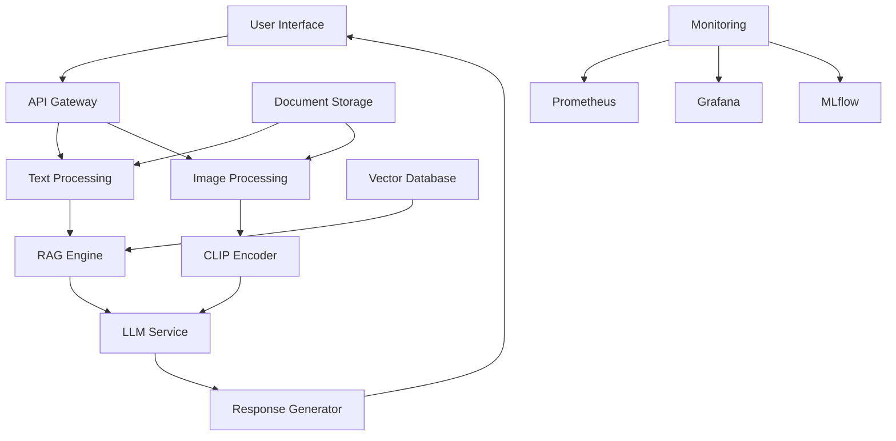

# Multi-modal-Enterprise-KM-Agent

# Multimodal Enterprise Knowledge Management Agent

<div align="center">


**An intelligent knowledge management system that understands both text and images, built with modern AI stack**

[Features](#features) • [Installation](#installation) • [Quick Start](#quick-start) • [API Docs](#api-documentation) • [Development](#development)

</div>

## 🚀 Overview

The Multimodal Enterprise Knowledge Management Agent is a production-ready AI system that enables intelligent querying of enterprise knowledge bases. Starting from text-based Q&A, the system evolves to understand and process multimodal content (text + images) through iterative agile development.

### 🎯 Key Capabilities

- **Intelligent Document Processing**: Extract insights from PDFs, images, and mixed documents
- **Multimodal Understanding**: Answer questions based on both text content and visual information
- **Production-Ready Architecture**: Scalable microservices deployed on Kubernetes
- **Continuous Learning**: Domain adaptation through fine-tuning and feedback loops

## 📋 Project Architecture



## 🛠 Technology Stack

### Infrastructure
- **Python 3.9+** - Core programming language
- **Docker** - Containerization
- **Kubernetes** - Orchestration (AWS EKS)
- **AWS** - Cloud infrastructure (EC2, S3, EKS)

### AI/ML Stack
- **PyTorch** - Deep learning framework
- **Hugging Face Transformers** - Model hub and utilities
- **vLLM** - High-performance LLM serving
- **PEFT/LoRA** - Parameter-efficient fine-tuning

### Core Components
- **Llama 3** - Foundation language model
- **CLIP** - Multimodal understanding
- **LangChain** - LLM application framework
- **ChromaDB** - Vector database

### Production Tools
- **FastAPI** - REST API framework
- **MLflow** - Experiment tracking
- **Prometheus/Grafana** - Monitoring
- **GitHub Actions** - CI/CD

## 📁 Project Structure

```
multimodal-knowledge-agent/
├── src/
│   ├── api/                 # FastAPI application
│   ├── rag/                 # Retrieval-Augmented Generation
│   ├── models/              # Model definitions and fine-tuning
│   ├── multimodal/          # CLIP and image processing
│   └── utils/               # Utility functions
├── k8s/                     # Kubernetes manifests
├── docker/                  # Docker configurations
├── tests/                   # Test suites
├── data/                    # Sample data and datasets
├── docs/                    # Documentation
└── scripts/                 # Deployment and utility scripts
```

## ⚡ Quick Start

### Prerequisites

- Python 3.9+
- Docker & Docker Compose
- NVIDIA GPU with CUDA 11.8+ (for local development)
- 16GB+ RAM recommended

### Local Development

1. **Clone the repository**
```bash
git clone https://github.com/your-org/multimodal-knowledge-agent.git
cd multimodal-knowledge-agent
```

2. **Set up environment**
```bash
python -m venv venv
source venv/bin/activate  # On Windows: venv\Scripts\activate
pip install -r requirements.txt
```

3. **Start services with Docker Compose**
```bash
docker-compose up -d
```

4. **Access the application**
- API: http://localhost:8000
- API Documentation: http://localhost:8000/docs
- MLflow UI: http://localhost:5000

### Basic Usage

```python
from knowledge_agent import MultimodalAgent

# Initialize the agent
agent = MultimodalAgent()

# Process a document
document_path = "path/to/your/document.pdf"
agent.ingest_document(document_path)

# Ask a question
response = agent.ask_question("What are the key findings in this document?")
print(response.answer)

# Ask about an image
image_question = "What does this diagram show?"
image_path = "path/to/diagram.png"
response = agent.ask_multimodal_question(image_question, image_path)
```

## 📚 API Documentation

### Core Endpoints

**POST /v1/documents/upload**
- Upload and process documents
- Supports PDF, PNG, JPG formats
- Returns document ID for reference

**POST /v1/query**
- Text-based question answering
```json
{
  "question": "What is our company's security policy?",
  "document_ids": ["doc_123"]  # optional
}
```

**POST /v1/multimodal/query**
- Multimodal question answering
```json
{
  "question": "Explain this architecture diagram",
  "image": "base64_encoded_image",
  "document_context": "optional_text_context"
}
```

### Example Usage

```bash
# Upload a document
curl -X POST "http://localhost:8000/v1/documents/upload" \
  -H "Content-Type: multipart/form-data" \
  -F "file=@technical_spec.pdf"

# Ask a question
curl -X POST "http://localhost:8000/v1/query" \
  -H "Content-Type: application/json" \
  -d '{
    "question": "What are the system requirements?"
  }'
```

## 🔧 Development Guide

### Sprint-Based Development

This project follows a 3-sprint agile development approach:

#### Sprint 1: Core Text MVP
- Basic RAG pipeline with text documents
- Local FastAPI service with vLLM
- Docker containerization

#### Sprint 2: Model Optimization
- PEFT/LoRA fine-tuning with MLflow tracking
- Model quantization and performance optimization
- A/B testing framework

#### Sprint 3: Production & Multimodal
- Kubernetes deployment on AWS EKS
- CLIP integration for multimodal understanding
- Production monitoring and CI/CD

### Running Tests

```bash
# Run unit tests
pytest tests/unit/ -v

# Run integration tests
pytest tests/integration/ -v

# Run with coverage
pytest --cov=src tests/ -v
```

### Contributing

1. Fork the repository
2. Create a feature branch (`git checkout -b feature/amazing-feature`)
3. Commit your changes (`git commit -m 'Add amazing feature'`)
4. Push to the branch (`git push origin feature/amazing-feature`)
5. Open a Pull Request

## 🚀 Deployment

### Production Deployment on AWS EKS

1. **Set up EKS cluster**
```bash
cd k8s/
./deploy-cluster.sh
```

2. **Deploy application**
```bash
kubectl apply -f namespaces/
kubectl apply -f deployments/
kubectl apply -f services/
```

3. **Monitor deployment**
```bash
kubectl get pods -n knowledge-agent
kubectl logs -f deployment/knowledge-agent-api -n knowledge-agent
```

### Environment Variables

```bash
# Database
VECTOR_DB_URL=chromadb:8000
MODEL_PATH=/models/llama3-8b

# AWS Configuration
AWS_REGION=us-west-2
S3_BUCKET=knowledge-documents

# Security
API_KEY=your-secret-key
JWT_SECRET=your-jwt-secret
```

## 📊 Monitoring & Analytics

The application includes comprehensive monitoring:

- **Prometheus**: Metrics collection
- **Grafana**: Visualization dashboards
- **MLflow**: Experiment tracking
- **Application Logs**: Structured JSON logging

Access monitoring tools:
- Grafana: http://localhost:3000
- Prometheus: http://localhost:9090
- MLflow: http://localhost:5000

## 🤝 Contributing

We welcome contributions! Please see our [Contributing Guide](docs/CONTRIBUTING.md) for details.

### Development Setup

1. Set up pre-commit hooks:
```bash
pre-commit install
```

2. Run the test suite:
```bash
pytest tests/ -xvs
```

3. Check code quality:
```bash
flake8 src/
black --check src/
mypy src/
```

## 📄 License

This project is licensed under the MIT License - see the [LICENSE](LICENSE) file for details.

## 🙏 Acknowledgments

- [Hugging Face](https://huggingface.co) for transformer models and libraries
- [Meta AI](https://ai.meta.com) for Llama models
- [vLLM](https://github.com/vllm-project/vllm) for efficient LLM serving
- [LangChain](https://github.com/langchain-ai/langchain) for LLM application framework

## 📞 Support

- **Documentation**: [docs/](docs/)
- **Issues**: [GitHub Issues](https://github.com/hongwei-cai/Multi-modal-Enterprise-KM-Agent/issues)
- **Discussions**: [GitHub Discussions](https://github.com/hongwei-cai/Multi-modal-Enterprise-KM-Agent/discussions)
- **Email**: vincentcai@duck.com

---

<div align="center">

**Built with ❤️ by Vincent Cai**

*Last updated: September 2025*

</div>
