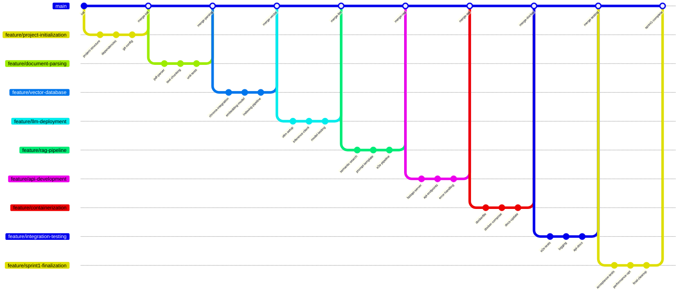

# Sprint 1: Core Text Q&A MVP - User Story Splitting

## Story 1: Project Infrastructure Setup ✅
**Branch Name**: `feature/project-initialization`

### Commit Sequence:
1. **Commit Message**: `feat: initialize project structure with src, tests, docs directories` ✅
   - Created base project structure
   - Added `README.md` and project description

2. **Commit Message**: `feat: add requirements.txt with core dependencies` ✅
   - Added PyTorch, Transformers, FastAPI, and other core dependencies
   - Configured Python version requirements

3. **Commit Message**: `feat: setup gitignore and pre-commit hooks` ✅
   - Added `.gitignore` to exclude model weights and cache files
   - Configured `pre-commit` for code quality checks

---

## Story 2: Document Parsing and Processing Pipeline
**Branch Name**: `feature/document-parsing`

### Commit Sequence:
1. **Commit Message**: `feat: implement PDF parser using pypdf` ✅
   - Implemented PDF text extraction functionality
   - Added error handling and logging

2. **Commit Message**: `feat: add text chunking with overlap strategy` ✅
   - Implemented sliding-window text chunking
   - Configured adjustable chunk size and overlap

3. **Commit Message**: `test: add unit tests for document parsing pipeline` ✅
   - Added test cases for PDF parser
   - Validated text chunk boundary handling

---

## Story 3: Vector Database Integration
**Branch Name**: `feature/vector-database`

### Commit Sequence:
1. **Commit Message**: `feat: integrate ChromaDB for vector storage` ✅
   - Implemented ChromaDB client connection
   - Designed document collection schema

2. **Commit Message**: `feat: add BGE embedding model integration` ✅
   - Integrated Hugging Face BGE model (later switch to BAAI/bge-m3)
   - sentence-transformers/all-MiniLM-L6-v2 for local development
   - Implemented batch text embedding generation

3. **Commit Message**: `feat: implement document indexing pipeline` ✅
   - Built end-to-end document→chunk→embedding→storage workflow
   - Added progress tracking and error recovery

---

## Story 4: LLM Local Deployment and Inference
**Branch Name**: `feature/llm-deployment`

### Commit Sequence:
1. **Commit Message**: `feat: setup vLLM with DialoGPT-medium model` ✅
   - Downloaded and configured DialoGPT-medium model
   - Implemented vLLM startup script

2. **Commit Message**: `feat: implement model inference client` ✅
   - Created vLLM API client
   - Added generation parameter configuration (temperature, top_p)

3. **Commit Message**: `test: validate model response quality` ✅
   - Added basic QA test cases
   - Verified model response format and content

---

## Story 5: RAG Core Pipeline Implementation
**Branch Name**: `feature/rag-pipeline`

### Commit Sequence:
1. **Commit Message**: `feat: implement semantic search retriever` ✅
   - Implemented vector similarity-based retriever
   - Configured top-k results return

2. **Commit Message**: `feat: design RAG prompt template` ✅
   - Created context+question prompt template
   - Added system role definition

3. **Commit Message**: `feat: build end-to-end RAG pipeline` ✅
   - Integrated retriever+LLM generation workflow
   - Implemented context truncation and stitching

---

## Story 6: FastAPI Service Development
**Branch Name**: `feature/api-development`

### Commit Sequence:
1. **Commit Message**: `feat: implement FastAPI server with health check` ✅
   - Created base FastAPI application
   - Added health check endpoint

2. **Commit Message**: `feat: add document upload and question endpoints` ✅
   - Implemented document upload (PDF support)
   - Implemented QA endpoint (question→answer)

3. **Commit Message**: `feat: add request validation and error handling` ✅
   - Added Pydantic models for input validation
   - Implemented unified error handling middleware

---

## Story 7: Docker Containerization
**Branch Name**: `feature/containerization`

### Commit Sequence:
1. **Commit Message**: `feat: create multi-stage Dockerfile` ✅
   - Built optimized-size Docker image
   - Staged dependency installation and code copying

2. **Commit Message**: `feat: add docker-compose for local development` ✅
   - Created `docker-compose.yml` to coordinate services
   - Configured ChromaDB and API dependencies

3. **Commit Message**: `docs: update README with docker usage instructions` ✅
   - Added containerization deployment guide
   - Provided quick-start commands

---

## Story 8: End-to-End Integration Testing
**Branch Name**: `feature/integration-testing`

### Commit Sequence:
1. **Commit Message**: `test: create end-to-end test pipeline` ✅
   - Implemented full-flow test: upload→question→answer validation
   - Added test dataset and expected results

2. **Commit Message**: `feat: add logging and monitoring middleware` ✅
   - Integrated structured logging
   - Added request latency monitoring

3. **Commit Message**: `docs: create API documentation with examples` ✅
   - Generated OpenAPI documentation
   - Added curl request examples

---

## Story 9: Sprint 1 Acceptance and Optimization
**Branch Name**: `feature/sprint1-finalization`

### Commit Sequence:
1. **Commit Message**: `test: validate all acceptance criteria are met`
   - Ran full acceptance test suite
   - Verified PDF processing, QA accuracy

2. **Commit Message**: `perf: optimize chunking and retrieval performance`
   - Improved text chunking speed
   - Enhanced vector retrieval efficiency

3. **Commit Message**: `chore: final code cleanup and documentation`
   - Refactored code and added comments
   - Updated project documentation and deployment guide

