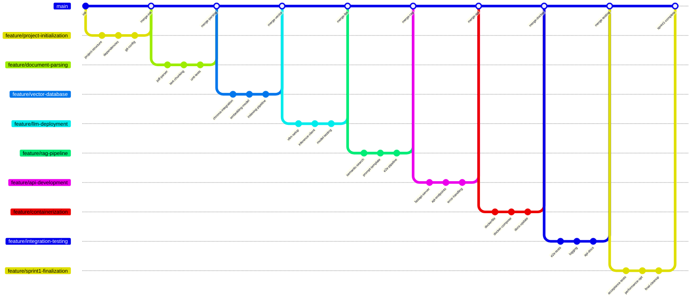

# Sprint 1：核心文本问答MVP - 用户故事拆分
## Story 1: 项目基础架构搭建

**分支名**: `feature/project-initialization`

### 提交序列:
1. **提交信息**: `feat: initialize project structure with src, tests, docs directories`
   - 创建基础项目结构
   - 添加README.md和项目描述

2. **提交信息**: `feat: add requirements.txt with core dependencies`
   - 添加PyTorch, Transformers, FastAPI等核心依赖
   - 配置Python版本要求

3. **提交信息**: `feat: setup gitignore and pre-commit hooks`
   - 添加.gitignore排除模型权重和缓存文件
   - 配置pre-commit进行代码质量检查

## Story 2: 文档解析与处理管道

**分支名**: `feature/document-parsing`

### 提交序列:
1. **提交信息**: `feat: implement PDF parser using pypdf`
   - 实现PDF文本提取功能
   - 添加错误处理和日志记录

2. **提交信息**: `feat: add text chunking with overlap strategy`
   - 实现滑动窗口文本分块
   - 配置可调节的块大小和重叠大小

3. **提交信息**: `test: add unit tests for document parsing pipeline`
   - 为PDF解析器添加测试用例
   - 验证文本分块边界处理

## Story 3: 向量数据库集成

**分支名**: `feature/vector-database`

### 提交序列:
1. **提交信息**: `feat: integrate ChromaDB for vector storage`
   - 实现ChromaDB客户端连接
   - 设计文档集合schema

2. **提交信息**: `feat: add BGE embedding model integration`
   - 集成Hugging Face BGE模型
   - 实现批量文本嵌入生成

3. **提交信息**: `feat: implement document indexing pipeline`
   - 构建文档→分块→嵌入→存储完整流程
   - 添加进度跟踪和错误恢复

## Story 4: LLM本地部署与推理

**分支名**: `feature/llm-deployment`

### 提交序列:
1. **提交信息**: `feat: setup vLLM with Llama 3 8B model`
   - 下载并配置Llama 3 8B模型
   - 实现vLLM启动脚本

2. **提交信息**: `feat: implement model inference client`
   - 创建vLLM API客户端
   - 添加生成参数配置（temperature, top_p）

3. **提交信息**: `test: validate model response quality`
   - 添加基础问答测试用例
   - 验证模型响应格式和内容

## Story 5: RAG核心管道实现

**分支名**: `feature/rag-pipeline`

### 提交序列:
1. **提交信息**: `feat: implement semantic search retriever`
   - 实现基于向量相似度的检索器
   - 配置top-k结果返回

2. **提交信息**: `feat: design RAG prompt template`
   - 创建包含上下文和问题的提示词模板
   - 添加系统角色设定

3. **提交信息**: `feat: build end-to-end RAG pipeline`
   - 集成检索器+LLM生成完整流程
   - 实现上下文截断和拼接

## Story 6: FastAPI服务开发

**分支名**: `feature/api-development`

### 提交序列:
1. **提交信息**: `feat: implement FastAPI server with health check`
   - 创建基础FastAPI应用
   - 添加健康检查端点

2. **提交信息**: `feat: add document upload and question endpoints`
   - 实现文档上传接口（支持PDF）
   - 实现问答接口（接收问题，返回答案）

3. **提交信息**: `feat: add request validation and error handling`
   - 添加Pydantic模型进行输入验证
   - 实现统一错误处理中间件

## Story 7: Docker容器化

**分支名**: `feature/containerization`

### 提交序列:
1. **提交信息**: `feat: create multi-stage Dockerfile`
   - 构建优化大小的Docker镜像
   - 分阶段安装依赖和复制代码

2. **提交信息**: `feat: add docker-compose for local development`
   - 创建docker-compose.yml协调服务
   - 配置ChromaDB和API服务依赖关系

3. **提交信息**: `docs: update README with docker usage instructions`
   - 添加容器化部署指南
   - 提供快速启动命令

## Story 8: 端到端集成测试

**分支名**: `feature/integration-testing`

### 提交序列:
1. **提交信息**: `test: create end-to-end test pipeline`
   - 实现完整流程测试：上传文档→提问→验证答案
   - 添加测试数据集和预期结果

2. **提交信息**: `feat: add logging and monitoring middleware`
   - 集成结构化日志记录
   - 添加请求耗时监控

3. **提交信息**: `docs: create API documentation with examples`
   - 生成OpenAPI文档
   - 添加curl请求示例

## Story 9: Sprint 1验收与优化

**分支名**: `feature/sprint1-finalization`

### 提交序列:
1. **提交信息**: `test: validate all acceptance criteria are met`
   - 运行完整验收测试套件
   - 验证PDF处理、问答准确性等标准

2. **提交信息**: `perf: optimize chunking and retrieval performance`
   - 优化文本分块速度
   - 改进向量检索效率

3. **提交信息**: `chore: final code cleanup and documentation`
   - 代码重构和注释完善
   - 更新项目文档和部署指南

## 合并策略建议

