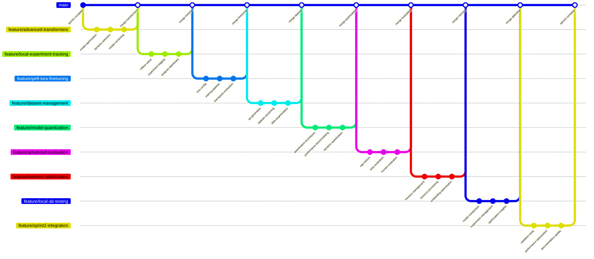

# Sprint 2: Model Customization and Performance Optimization - Local Transformers Edition

## Story 1: Advanced Model Management with Transformers

**Branch Name**: `feature/advanced-transformers`

### Commit Sequence:
1. **Commit Message**: `feat: enhance LLM client with model optimization features` ✅
   - Add model quantization support (4-bit/8-bit)
   - Implement device mapping optimization for M1 Pro
   - Add model caching and memory management

2. **Commit Message**: `feat: implement dynamic model selection strategy` ✅
   - Create quality-speed tradeoff configurations
   - Add automatic model downgrade under memory pressure
   - Implement model performance benchmarking

3. **Commit Message**: `feat: add model versioning and hot-swapping`
   - Implement seamless model switching
   - Add model configuration management
   - Create A/B testing framework for different models

## Story 2: Local Experiment Tracking Infrastructure

**Branch Name**: `feature/local-experiment-tracking`

### Commit Sequence:
1. **Commit Message**: `feat: setup MLflow for local experiment tracking`
   - Configure MLflow with SQLite backend
   - Implement experiment organization and versioning
   - Add model performance metrics logging

2. **Commit Message**: `feat: implement comprehensive experiment logging`
   - Log prompt variations and model responses
   - Track retrieval performance and accuracy metrics
   - Monitor system resource usage during experiments

3. **Commit Message**: `feat: create experiment analysis dashboard`
   - Build local MLflow UI for result visualization
   - Implement experiment comparison and diffing
   - Add performance trend analysis

## Story 3: PEFT/LoRA Fine-tuning Implementation

**Branch Name**: `feature/peft-lora-finetuning`

### Commit Sequence:
1. **Commit Message**: `feat: implement LoRA configuration for local models`
   - Set up PEFT with optimal parameters for M1 Pro
   - Configure LoRA layers for efficient adaptation
   - Add model adapter saving and loading

2. **Commit Message**: `feat: build local fine-tuning pipeline`
   - Create training loop with gradient checkpointing
   - Implement memory-efficient data loading
   - Add learning rate scheduling and optimization

3. **Commit Message**: `feat: implement model checkpointing and evaluation`
   - Add validation during training
   - Implement best model selection
   - Create fine-tuned model integration

## Story 4: Dataset Creation and Management

**Branch Name**: `feature/dataset-management`

### Commit Sequence:
1. **Commit Message**: `feat: implement QA dataset generation from documents`
   - Create automated question-answer pair generation
   - Implement context-based QA extraction
   - Add data quality validation

2. **Commit Message**: `feat: build dataset versioning and management`
   - Implement dataset splitting and sampling
   - Add dataset quality metrics
   - Create dataset comparison tools

3. **Commit Message**: `feat: add data augmentation and preprocessing`
   - Implement text augmentation techniques
   - Add data cleaning and normalization
   - Create synthetic data generation

## Story 5: Model Quantization and Optimization

**Branch Name**: `feature/model-quantization`

### Commit Sequence:
1. **Commit Message**: `feat: implement model quantization techniques`
   - Add 4-bit quantization support
   - Implement 8-bit quantization for better quality
   - Create quantization-aware training pipeline

2. **Commit Message**: `feat: build performance benchmarking suite`
   - Implement latency and throughput measurements
   - Add memory usage tracking
   - Create quality degradation analysis

3. **Commit Message**: `feat: add dynamic quantization strategies`
   - Implement on-the-fly quantization
   - Add model compression techniques
   - Create optimal quantization selection

## Story 6: Advanced Evaluation Framework

**Branch Name**: `feature/advanced-evaluation`

### Commit Sequence:
1. **Commit Message**: `feat: implement comprehensive RAG evaluation metrics`
   - Add retrieval accuracy scoring
   - Implement answer quality assessment
   - Create context utilization metrics

2. **Commit Message**: `feat: build automated evaluation pipeline`
   - Implement batch evaluation on test sets
   - Add performance regression detection
   - Create evaluation report generation

3. **Commit Message**: `feat: add human evaluation workflow`
   - Create local evaluation interface
   - Implement side-by-side model comparison
   - Add manual quality scoring

## Story 7: Memory Optimization for M1 Pro

**Branch Name**: `feature/memory-optimization`

### Commit Sequence:
1. **Commit Message**: `feat: implement smart memory management`
   - Add dynamic model loading/unloading
   - Implement memory usage monitoring
   - Create automatic cleanup procedures

2. **Commit Message**: `feat: build resource-aware processing`
   - Implement batch size optimization
   - Add memory pressure detection
   - Create graceful degradation handling

3. **Commit Message**: `feat: add embedding model optimization`
   - Implement on-demand embedding loading
   - Add embedding caching strategies
   - Create memory-efficient batch processing

## Story 8: Local A/B Testing Framework

**Branch Name**: `feature/local-ab-testing`

### Commit Sequence:
1. **Commit Message**: `feat: implement model comparison framework`
   - Create parallel model inference
   - Add response quality scoring
   - Implement statistical significance testing

2. **Commit Message**: `feat: build experiment management system`
   - Add experiment configuration
   - Implement result collection and analysis
   - Create automated experiment reporting

3. **Commit Message**: `feat: add performance optimization insights`
   - Generate optimization recommendations
   - Create cost-performance tradeoff analysis
   - Implement best practice suggestions

## Story 9: Sprint 2 Integration and Validation

**Branch Name**: `feature/sprint2-integration`

### Commit Sequence:
1. **Commit Message**: `test: validate fine-tuning and optimization results`
   - Verify 10% improvement in domain-specific tasks
   - Confirm memory usage within safe limits
   - Validate system stability

2. **Commit Message**: `perf: optimize end-to-end system performance`
   - Fine-tune all components for M1 Pro
   - Implement memory usage optimization
   - Improve response times

3. **Commit Message**: `docs: update model customization guide`
   - Document fine-tuning procedures
   - Create performance optimization guide
   - Add troubleshooting documentation

