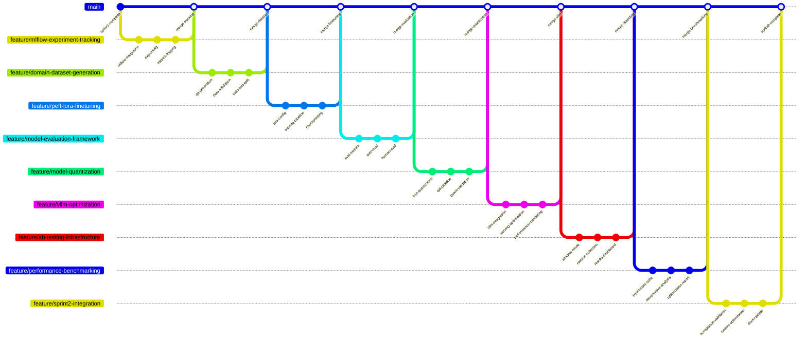

# Sprint 2: Model Customization and Performance Optimization - User Stories Breakdown

## Story 1: Experiment Tracking Infrastructure

**Branch Name**: `feature/mlflow-experiment-tracking`

### Commit Sequence:
1. **Commit Message**: `feat: integrate MLflow for experiment tracking`
   - Install and configure MLflow tracking server
   - Set up experiment and run management

2. **Commit Message**: `feat: add experiment configuration management`
   - Create configurable experiment parameters (hyperparameters, model settings)
   - Implement parameter validation and serialization

3. **Commit Message**: `feat: implement metrics logging and visualization`
   - Log training metrics (loss, accuracy) to MLflow
   - Set up metric comparison dashboards

## Story 2: Domain-Specific QA Dataset Creation

**Branch Name**: `feature/domain-dataset-generation`

### Commit Sequence:
1. **Commit Message**: `feat: implement QA pair generation from documents`
   - Create automated QA generation using LLM
   - Extract question-answer pairs from existing knowledge base

2. **Commit Message**: `feat: add data validation and quality checks`
   - Implement data quality metrics (answer relevance, question clarity)
   - Add manual review and correction workflow

3. **Commit Message**: `feat: create train/validation/test splits`
   - Implement stratified splitting based on document topics
   - Ensure no data leakage between splits

## Story 3: PEFT/LoRA Fine-tuning Implementation

**Branch Name**: `feature/peft-lora-finetuning`

### Commit Sequence:
1. **Commit Message**: `feat: implement LoRA configuration for Llama 3`
   - Set up PEFT LoRA parameters (rank, alpha, dropout)
   - Configure target modules for efficient adaptation

2. **Commit Message**: `feat: build fine-tuning training pipeline`
   - Create training loop with gradient accumulation
   - Implement learning rate scheduling and optimizer configuration

3. **Commit Message**: `feat: add model checkpointing and resume capability`
   - Implement checkpoint saving based on validation metrics
   - Add training resumption from checkpoints

## Story 4: Model Evaluation Framework

**Branch Name**: `feature/model-evaluation-framework`

### Commit Sequence:
1. **Commit Message**: `feat: implement comprehensive evaluation metrics`
   - Add BLEU, ROUGE, and semantic similarity metrics
   - Create domain-specific accuracy measurements

2. **Commit Message**: `feat: build automated evaluation pipeline`
   - Implement batch evaluation on test set
   - Add result aggregation and reporting

3. **Commit Message**: `feat: create human evaluation framework`
   - Build interface for manual quality assessment
   - Implement inter-annotator agreement metrics

## Story 5: Model Quantization Implementation

**Branch Name**: `feature/model-quantization`

### Commit Sequence:
1. **Commit Message**: `feat: implement INT4 quantization with AWQ/GPTQ`
   - Integrate quantization libraries (autoawq, gptq)
   - Configure quantization parameters and calibration

2. **Commit Message**: `feat: add quantization-aware training pipeline`
   - Implement QAT for better quantized performance
   - Add quantization error analysis tools

3. **Commit Message**: `feat: validate quantized model performance`
   - Benchmark accuracy preservation after quantization
   - Test quantized model inference compatibility

## Story 6: vLLM Optimization Integration

**Branch Name**: `feature/vllm-optimization`

### Commit Sequence:
1. **Commit Message**: `feat: integrate fine-tuned model with vLLM`
   - Update vLLM deployment for custom fine-tuned models
   - Configure model loading and serving parameters

2. **Commit Message**: `feat: optimize vLLM serving parameters`
   - Tune batch size, max sequence length, and parallel processing
   - Implement continuous batching optimization

3. **Commit Message**: `feat: add performance monitoring to vLLM`
   - Integrate latency and throughput monitoring
   - Set up GPU memory usage tracking

## Story 7: A/B Testing Infrastructure

**Branch Name**: `feature/ab-testing-infrastructure`

### Commit Sequence:
1. **Commit Message**: `feat: implement shadow mode deployment`
   - Create parallel inference for baseline vs fine-tuned models
   - Add request routing and response comparison

2. **Commit Message**: `feat: build A/B testing metrics collection`
   - Implement user feedback and quality scoring
   - Add statistical significance testing

3. **Commit Message**: `feat: create A/B test results dashboard`
   - Build comparative performance visualization
   - Implement automated winner determination

## Story 8: Performance Benchmarking Suite

**Branch Name**: `feature/performance-benchmarking`

### Commit Sequence:
1. **Commit Message**: `feat: create comprehensive benchmarking suite`
   - Implement latency, throughput, and memory benchmarks
   - Add stress testing and load testing capabilities

2. **Commit Message**: `feat: add comparative performance analysis`
   - Benchmark fine-tuned vs baseline models
   - Compare quantized vs full-precision performance

3. **Commit Message**: `feat: generate performance optimization report`
   - Create automated performance reporting
   - Document optimization recommendations

## Story 9: Sprint 2 Integration and Validation

**Branch Name**: `feature/sprint2-integration`

### Commit Sequence:
1. **Commit Message**: `test: validate all acceptance criteria`
   - Run end-to-end validation of fine-tuning pipeline
   - Verify 10% accuracy improvement target

2. **Commit Message**: `perf: optimize end-to-end system performance`
   - Fine-tune system parameters based on benchmarking results
   - Optimize memory usage and inference speed

3. **Commit Message**: `docs: update documentation with optimization results`
   - Document fine-tuning process and results
   - Create performance optimization guide

## Git Workflow Visualization

## Success Metrics for Each Story

- **Story 1**: MLflow tracks 100% of experiments with reproducible configurations
- **Story 2**: Generate 1000+ high-quality QA pairs covering domain knowledge
- **Story 3**: Fine-tuned model shows measurable improvement on validation set
- **Story 4**: Evaluation framework provides comprehensive model assessment
- **Story 5**: Quantization reduces model size by 40% with <2% accuracy drop
- **Story 6**: vLLM optimization achieves 30% inference speed improvement
- **Story 7**: A/B testing provides statistical significance (p < 0.05)
- **Story 8**: Performance benchmarks show consistent improvement across metrics
- **Story 9**: All Sprint 2 acceptance criteria met and documented
