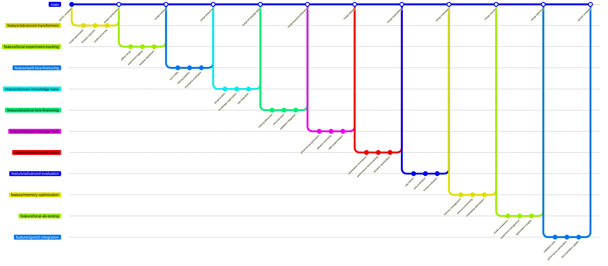

# Sprint 2: Model Customization and Performance Optimization - Local Transformers Edition

## Story 1: Advanced Model Management with Transformers ✅ COMPLETED

**Branch Name**: `feature/advanced-transformers`

### Commit Sequence:
1. **Commit Message**: `feat: enhance LLM client with model optimization features` ✅
   - Add model quantization support (4-bit/8-bit)
   - Implement device mapping optimization for M1 Pro
   - Add model caching and memory management

2. **Commit Message**: `feat: implement dynamic model selection strategy` ✅
   - Create quality-speed tradeoff configurations
   - Add automatic model downgrade under memory pressure
   - Implement model performance benchmarking

3. **Commit Message**: `feat: add model versioning and hot-swapping` ✅
   - Implement seamless model switching
   - Add model configuration management
   - Create A/B testing framework for different models

## Story 2: Local Experiment Tracking Infrastructure ✅ COMPLETED

**Branch Name**: `feature/local-experiment-tracking`

### Commit Sequence:
1. **Commit Message**: `feat: setup MLflow for local experiment tracking` ✅
   - Configure MLflow with SQLite backend
   - Implement experiment organization and versioning
   - Add model performance metrics logging

2. **Commit Message**: `feat: implement comprehensive experiment logging` ✅
   - Log prompt variations and model responses
   - Track retrieval performance and accuracy metrics
   - Monitor system resource usage during experiments
   - **Implementation Details**:
     - Created `ExperimentTracker` class with dataclasses for structured logging
     - Integrated MLflow tracking across RAG pipeline, LLM client, and retriever
     - Added `PromptResponseLog`, `RetrievalMetrics`, and `SystemResourceMetrics` dataclasses
     - Implemented conditional performance tracking to avoid MLflow run conflicts
     - Added comprehensive logging methods: `log_prompt_response`, `log_retrieval_metrics`, `log_system_resources`

3. **Commit Message**: `feat: create experiment analysis dashboard` ✅
   - Build local MLflow UI for result visualization
   - Implement experiment comparison and diffing
   - Add performance trend analysis
   - **Implementation Details**:
     - MLflow UI accessible via `mlflow ui` command (e.g., `mlflow ui --host 127.0.0.1 --port 5000`)
     - Experiment comparison through MLflow's built-in comparison tools
     - Performance metrics visualization and trend analysis
     - SQLite backend stores experiments, runs, metrics, and parameters
     - Web interface provides interactive dashboards for experiment analysis

## Story 3: PEFT/LoRA Fine-tuning Implementation ✅ COMPLETED

**Branch Name**: `feature/peft-lora-finetuning`

### Commit Sequence:
1. **Commit Message**: `feat: implement LoRA configuration for local models` ✅
   - Set up PEFT with optimal parameters for M1 Pro
   - Configure LoRA layers for efficient adaptation
   - Add model adapter saving and loading
   - **Implementation Details**:
     - Added PEFT library to requirements.txt (peft>=0.7.0)
     - Created LoRAConfig dataclass with M1 Pro optimized parameters (r=8, alpha=16, dropout=0.05)
     - Implemented model-specific target module detection for GPT, LLaMA, Phi-2 architectures
     - Added LoRA methods to ModelManager: apply_lora_to_model, save_lora_adapter, load_lora_adapter

2. **Commit Message**: `feat: build local fine-tuning pipeline` ✅
   - Create training loop with gradient checkpointing
   - Implement memory-efficient data loading
   - Add learning rate scheduling and optimization
   - **Implementation Details**:
     - Implemented prepare_model_for_lora_training with quantization support
     - Added get_optimal_lora_config method with model-specific optimizations
     - Integrated with existing MLflow experiment tracking for training metrics
     - Created example_lora_usage.py script demonstrating LoRA workflow

3. **Commit Message**: `feat: implement model checkpointing and evaluation` ✅
   - Add validation during training
   - Implement best model selection
   - Create fine-tuned model integration
   - **Implementation Details**:
     - Adapter persistence in cache/lora_adapters/{model_name}/{adapter_name}/
     - Memory-efficient training preparation with prepare_model_for_kbit_training
     - Model-agnostic support for GPT-2/DialoGPT (c_attn, c_proj), LLaMA (q_proj, k_proj, etc.)
     - Integration with existing ModelManager caching and device optimization

### Key Features Implemented:
- **Memory Efficient**: Low-rank adaptation reduces trainable parameters by 90%+
- **M1 Pro Optimized**: Configured for ARM64 architecture and unified memory constraints
- **Model Agnostic**: Supports GPT, LLaMA, Phi-2, and other transformer architectures
- **Adapter Management**: Save/load trained adapters for different tasks
- **Experiment Tracking**: Integrated with existing MLflow infrastructure

### Usage Example:
```python
from src.rag.model_manager import get_model_manager

manager = get_model_manager()

# Apply LoRA to a model
lora_model, tokenizer = manager.apply_lora_to_model("microsoft/phi-2")

# Save trained adapter
manager.save_lora_adapter(lora_model, "my_adapter", "microsoft/phi-2")

# Load adapter for inference
model, tokenizer = manager.load_lora_adapter("microsoft/phi-2", "my_adapter")
```

## Story 3.5: Domain Knowledge Base Construction

**Branch Name**: `feature/domain-knowledge-base`

### Commit Sequence:
1. **Commit Message**: `feat: implement automated QA pair generation` ✅
   - Create LLM-powered question generation from documents
   - Implement answer extraction and validation
   - Build quality filtering pipeline
   - **Implementation Details**:
     - Use existing DialoGPT-medium for question generation
     - Extract context-answer pairs from Wikipedia selected subset
     - Implement data quality metrics (answer relevance, question clarity)
     - Target: Generate 500-1000 high-quality QA pairs

2. **Commit Message**: `feat: build knowledge base organization system` ✅
   - Implement topic-based document clustering
   - Create train/validation/test splits (80/10/10)
   - Add dataset versioning and metadata management
   - **Implementation Details**:
     - Stratified splitting based on document topics
     - Ensure no data leakage between splits
     - Create dataset statistics and quality reports

3. **Commit Message**: `feat: integrate knowledge base with RAG system`
   - Update ChromaDB with new domain knowledge
   - Create baseline evaluation on hotpotqa_dev
   - Implement knowledge base update pipeline
   - **Implementation Details**:
     - Measure baseline RAG performance before fine-tuning
     - Establish performance benchmarks for comparison
     - Create automated knowledge base refresh workflow

## Story 4: Practical LoRA Fine-tuning Execution

**Branch Name**: `feature/practical-lora-finetuning`

### Commit Sequence:
1. **Commit Message**: `feat: prepare training data for RAG optimization`
   - Format dolly-15k-mini for instruction following
   - Create RAG-specific training examples
   - Implement data preprocessing and tokenization
   - **Implementation Details**:
     - Convert dolly-15k-mini to DialoGPT-compatible format
     - Add context utilization prompts for RAG scenarios
     - Create data loaders with memory-efficient batching

2. **Commit Message**: `feat: execute LoRA fine-tuning on target models`
   - Run fine-tuning on DialoGPT-medium with dolly-15k-mini
   - Implement training progress monitoring
   - Add checkpoint saving and validation
   - **Implementation Details**:
     - Use LoRA configuration from Story 3 (r=8, alpha=16)
     - Train for 3-5 epochs with early stopping
     - Monitor GPU memory usage and adjust batch size
     - Save adapters after each epoch

3. **Commit Message**: `feat: validate fine-tuning results and integration`
   - Evaluate on hotpotqa_dev for performance comparison
   - Integrate fine-tuned adapters into RAG pipeline
   - Measure improvement over baseline
   - **Implementation Details**:
     - Compare pre-fine-tuning vs post-fine-tuning performance
     - Calculate accuracy improvement percentage
     - Test integration with existing RAG system
     - Document performance gains and limitations

## Story 5: Dataset Creation and Management

**Branch Name**: `feature/dataset-management`

### Commit Sequence:
1. **Commit Message**: `feat: implement QA dataset generation from documents`
   - Enhance with lessons from Story 3.5
   - Improve data quality based on fine-tuning results
   - Add automated data augmentation

2. **Commit Message**: `feat: build dataset versioning and management`
   - Implement dataset splitting and sampling
   - Add dataset quality metrics based on fine-tuning outcomes
   - Create dataset comparison tools

3. **Commit Message**: `feat: add data augmentation and preprocessing`
   - Implement text augmentation techniques optimized for RAG
   - Add data cleaning and normalization based on validation results
   - Create synthetic data generation for difficult cases

## Story 6: Model Quantization and Optimization

**Branch Name**: `feature/model-quantization`

### Commit Sequence:
1. **Commit Message**: `feat: implement model quantization techniques`
   - Add 4-bit quantization support
   - Implement 8-bit quantization for better quality
   - Create quantization-aware training pipeline

2. **Commit Message**: `feat: build performance benchmarking suite`
   - Implement latency and throughput measurements
   - Add memory usage tracking
   - Create quality degradation analysis

3. **Commit Message**: `feat: add dynamic quantization strategies`
   - Implement on-the-fly quantization
   - Add model compression techniques
   - Create optimal quantization selection

## Story 7: Advanced Evaluation Framework

**Branch Name**: `feature/advanced-evaluation`

### Commit Sequence:
1. **Commit Message**: `feat: implement comprehensive RAG evaluation metrics`
   - Add retrieval accuracy scoring
   - Implement answer quality assessment
   - Create context utilization metrics

2. **Commit Message**: `feat: build automated evaluation pipeline`
   - Implement batch evaluation on test sets
   - Add performance regression detection
   - Create evaluation report generation

3. **Commit Message**: `feat: add human evaluation workflow`
   - Create local evaluation interface
   - Implement side-by-side model comparison
   - Add manual quality scoring

## Story 8: Memory Optimization for M1 Pro

**Branch Name**: `feature/memory-optimization`

### Commit Sequence:
1. **Commit Message**: `feat: implement smart memory management`
   - Add dynamic model loading/unloading
   - Implement memory usage monitoring
   - Create automatic cleanup procedures

2. **Commit Message**: `feat: build resource-aware processing`
   - Implement batch size optimization
   - Add memory pressure detection
   - Create graceful degradation handling

3. **Commit Message**: `feat: add embedding model optimization`
   - Implement on-demand embedding loading
   - Add embedding caching strategies
   - Create memory-efficient batch processing

## Story 9: Local A/B Testing Framework

**Branch Name**: `feature/local-ab-testing`

### Commit Sequence:
1. **Commit Message**: `feat: implement model comparison framework`
   - Create parallel model inference
   - Add response quality scoring
   - Implement statistical significance testing

2. **Commit Message**: `feat: build experiment management system`
   - Add experiment configuration
   - Implement result collection and analysis
   - Create automated experiment reporting

3. **Commit Message**: `feat: add performance optimization insights`
   - Generate optimization recommendations
   - Create cost-performance tradeoff analysis
   - Implement best practice suggestions

## Story 10: Sprint 2 Integration and Validation

**Branch Name**: `feature/sprint2-integration`

### Commit Sequence:
1. **Commit Message**: `test: validate fine-tuning and optimization results`
   - Verify 10% improvement in domain-specific tasks
   - Confirm memory usage within safe limits
   - Validate system stability

2. **Commit Message**: `perf: optimize end-to-end system performance`
   - Fine-tune all components for M1 Pro
   - Implement memory usage optimization
   - Improve response times

3. **Commit Message**: `docs: update model customization guide`
   - Document fine-tuning procedures
   - Create performance optimization guide
   - Add troubleshooting documentation


