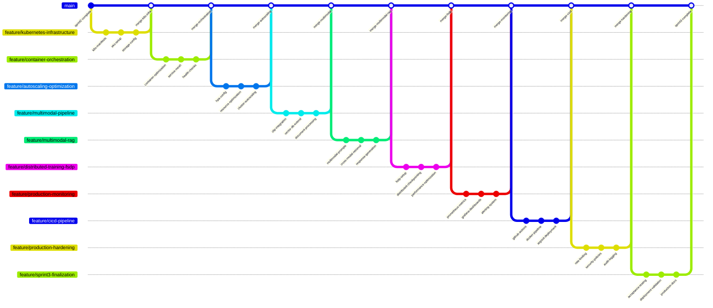

# Sprint 3: Productionization and Multimodal Expansion - User Stories Breakdown

## Story 1: Kubernetes Infrastructure Setup

**Branch Name**: `feature/kubernetes-infrastructure`

### Commit Sequence:
1. **Commit Message**: `feat: create Kubernetes manifests for all services`
   - Design Deployment, Service, and ConfigMap manifests
   - Set up namespace and resource quotas

2. **Commit Message**: `feat: configure AWS EKS cluster and node groups`
   - Set up EKS cluster with GPU-enabled node groups
   - Configure autoscaling and spot instances

3. **Commit Message**: `feat: implement persistent storage with EBS`
   - Configure PVCs for model storage and vector database
   - Set up backup and retention policies

## Story 2: Container Orchestration and Service Mesh

**Branch Name**: `feature/container-orchestration`

### Commit Sequence:
1. **Commit Message**: `feat: containerize all services with optimized Dockerfiles`
   - Create multi-stage builds for each microservice
   - Optimize image sizes and security scanning

2. **Commit Message**: `feat: implement service discovery and load balancing`
   - Configure Kubernetes Services and Ingress
   - Set up external load balancer with SSL termination

3. **Commit Message**: `feat: add health checks and liveness probes`
   - Implement readiness and liveness endpoints
   - Configure pod disruption budgets

## Story 3: Auto-scaling and Resource Management

**Branch Name**: `feature/autoscaling-optimization`

### Commit Sequence:
1. **Commit Message**: `feat: implement Horizontal Pod Autoscaler (HPA)`
   - Configure CPU and memory-based scaling
   - Set custom metrics for QPS-based scaling

2. **Commit Message**: `feat: add resource limits and requests optimization`
   - Fine-tune GPU memory allocation
   - Configure burstable QoS classes

3. **Commit Message**: `feat: implement cluster autoscaling`
   - Set up cluster autoscaler for dynamic node provisioning
   - Configure spot instance integration for cost optimization

## Story 4: Multimodal Data Processing Pipeline

**Branch Name**: `feature/multimodal-pipeline`

### Commit Sequence:
1. **Commit Message**: `feat: integrate CLIP model for image encoding`
   - Implement CLIP image and text encoder integration
   - Create unified embedding space for multimodal data

2. **Commit Message**: `feat: extend vector database for multimodal support`
   - Modify ChromaDB to handle image and text embeddings
   - Implement cross-modal retrieval capabilities

3. **Commit Message**: `feat: build multimodal document processing`
   - Create pipeline for extracting text and images from documents
   - Implement OCR integration for image text extraction

## Story 5: Multimodal RAG Implementation

**Branch Name**: `feature/multimodal-rag`

### Commit Sequence:
1. **Commit Message**: `feat: design multimodal prompt engineering`
   - Create templates for image+text question answering
   - Implement context aggregation from multiple modalities

2. **Commit Message**: `feat: implement cross-modal retrieval strategy`
   - Build hybrid search combining text and visual similarity
   - Add relevance scoring for multimodal results

3. **Commit Message**: `feat: create multimodal response generation`
   - Integrate vision-language models for comprehensive answers
   - Implement response formatting for mixed content types

## Story 6: Distributed Training Framework (FSDP)

**Branch Name**: `feature/distributed-training-fsdp`

### Commit Sequence:
1. **Commit Message**: `feat: set up PyTorch FSDP training environment`
   - Configure multi-node GPU training infrastructure
   - Implement FSDP wrapper for Llama 3 70B

2. **Commit Message**: `feat: implement distributed data loading and checkpointing`
   - Create sharded data loading for large datasets
   - Set up distributed checkpoint saving/loading

3. **Commit Message**: `feat: optimize FSDP performance with activation checkpointing`
   - Implement gradient checkpointing for memory optimization
   - Tune communication overlapping and sharding strategies

## Story 7: Production Monitoring and Observability

**Branch Name**: `feature/production-monitoring`

### Commit Sequence:
1. **Commit Message**: `feat: implement Prometheus metrics collection`
   - Instrument application with custom metrics
   - Set up metric exporters for GPU and system metrics

2. **Commit Message**: `feat: create Grafana dashboards for real-time monitoring`
   - Build dashboards for QPS, latency, error rates
   - Create GPU utilization and memory monitoring

3. **Commit Message**: `feat: set up alerting and notification system`
   - Configure alert rules for critical metrics
   - Integrate with PagerDuty/Slack notifications

## Story 8: CI/CD Pipeline for Kubernetes

**Branch Name**: `feature/cicd-pipeline`

### Commit Sequence:
1. **Commit Message**: `feat: implement GitHub Actions for automated testing`
   - Create workflow for unit and integration tests
   - Add security scanning and vulnerability checks

2. **Commit Message**: `feat: build automated Docker image pipeline`
   - Implement multi-architecture image builds
   - Set up image signing and vulnerability scanning

3. **Commit Message**: `feat: create GitOps deployment with ArgoCD`
   - Implement automated deployment to EKS
   - Set up blue-green deployment strategy

## Story 9: Performance and Security Hardening

**Branch Name**: `feature/production-hardening`

### Commit Sequence:
1. **Commit Message**: `feat: implement rate limiting and API throttling`
   - Add request rate limiting per user/IP
   - Configure circuit breaker pattern for resilience

2. **Commit Message**: `feat: enhance security with network policies and RBAC`
   - Set up network segmentation with Calico
   - Implement least privilege service accounts

3. **Commit Message**: `feat: add comprehensive logging and audit trails`
   - Implement structured logging with ELK stack
   - Set up audit logging for compliance

## Story 10: Sprint 3 Final Integration and Validation

**Branch Name**: `feature/sprint3-finalization`

### Commit Sequence:
1. **Commit Message**: `test: validate all production acceptance criteria`
   - Run load testing with 50+ QPS requirement
   - Verify multimodal functionality with real-world examples

2. **Commit Message**: `feat: implement zero-downtime deployment validation`
   - Test rolling updates and canary deployments
   - Validate data consistency during deployments

3. **Commit Message**: `docs: create production runbooks and operational guides`
   - Document incident response procedures
   - Create performance tuning guidelines

## Git Workflow Visualization

## Success Metrics for Each Story

- **Story 1**: EKS cluster running with 99.9% availability, proper storage configuration
- **Story 2**: All services containerized with <500ms cold start time
- **Story 3**: Auto-scaling handles 50+ QPS with <30s scale-out time
- **Story 4**: CLIP integration achieves >0.85 similarity score on cross-modal retrieval
- **Story 5**: Multimodal RAG provides accurate answers for image+text queries
- **Story 6**: FSDP training achieves >0.8 scaling efficiency on multi-node setup
- **Story 7**: Monitoring covers 100% critical metrics with <1min alert response
- **Story 8**: CI/CD enables <10min deployment from commit to production
- **Story 9**: Security hardening passes penetration testing, zero critical vulnerabilities
- **Story 10**: All Sprint 3 acceptance criteria met, production system stable

Each story builds toward the final goal of a production-ready, multimodal knowledge management system that can scale efficiently while maintaining high reliability and performance.
