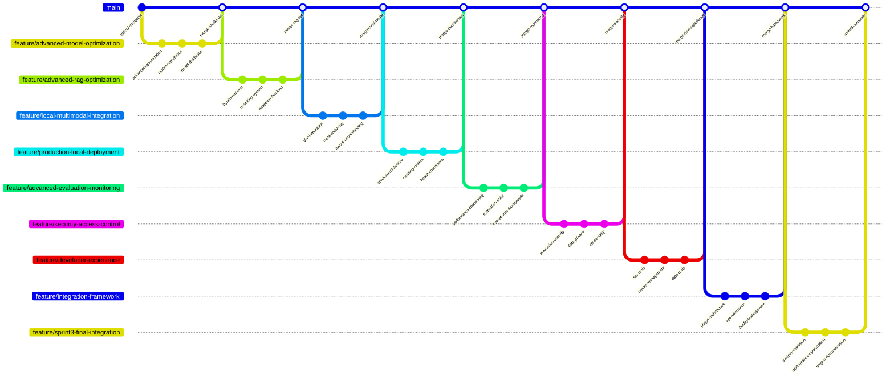

# Sprint 3: Advanced Local Optimization and Multimodal Expansion

## Story 1: Advanced Model Optimization and Quantization

**Branch Name**: `feature/advanced-model-optimization`

### Commit Sequence:
1. **Commit Message**: `feat: implement advanced quantization techniques`
   - Add GPTQ/AWQ quantization for better performance
   - Implement dynamic quantization for inference optimization
   - Create quantization-aware fine-tuning pipeline

2. **Commit Message**: `feat: build model compilation and optimization`
   - Implement torch.compile for model acceleration
   - Add kernel fusion and operator optimization
   - Create M1 Pro specific optimizations

3. **Commit Message**: `feat: add model distillation techniques`
   - Implement knowledge distillation from larger models
   - Create teacher-student training pipeline
   - Add model size-performance tradeoff analysis

## Story 2: Advanced RAG Optimization

**Branch Name**: `feature/advanced-rag-optimization`

### Commit Sequence:
1. **Commit Message**: `feat: implement hybrid retrieval strategies`
   - Combine dense, sparse, and keyword retrieval
   - Add query expansion and rewriting
   - Implement multi-stage retrieval pipeline

2. **Commit Message**: `feat: build advanced reranking system`
   - Integrate cross-encoder rerankers
   - Add semantic similarity scoring
   - Implement context quality assessment

3. **Commit Message**: `feat: create adaptive chunking strategies`
   - Implement semantic-aware text splitting
   - Add dynamic chunk size optimization
   - Create hierarchical document processing

## Story 3: Local Multimodal Integration

**Branch Name**: `feature/local-multimodal-integration`

### Commit Sequence:
1. **Commit Message**: `feat: integrate vision-language models locally`
   - Implement BLIP, LLaVA using Transformers
   - Add image encoding and understanding capabilities
   - Create unified multimodal embedding space

2. **Commit Message**: `feat: build multimodal RAG pipeline`
   - Implement cross-modal retrieval (text-to-image, image-to-text)
   - Add multimodal context fusion
   - Create visual question answering system

3. **Commit Message**: `feat: add document layout understanding`
   - Implement table and chart extraction
   - Add document structure analysis
   - Create multimodal document processing

## Story 4: Production-Ready Local Deployment

**Branch Name**: `feature/production-local-deployment`

### Commit Sequence:
1. **Commit Message**: `feat: implement production-grade service architecture`
   - Create async FastAPI with background processing
   - Add request queuing and load management
   - Implement graceful degradation

2. **Commit Message**: `feat: build advanced caching system`
   - Implement multi-level caching (memory, disk, embedding)
   - Add cache invalidation strategies
   - Create performance optimization dashboard

3. **Commit Message**: `feat: add health monitoring and recovery`
   - Implement comprehensive health checks
   - Add automatic service recovery
   - Create system resilience mechanisms

## Story 5: Advanced Evaluation and Monitoring

**Branch Name**: `feature/advanced-evaluation-monitoring`

### Commit Sequence:
1. **Commit Message**: `feat: implement real-time performance monitoring`
   - Add detailed metrics collection (latency, accuracy, memory)
   - Create performance trend analysis
   - Implement anomaly detection

2. **Commit Message**: `feat: build comprehensive evaluation suite`
   - Add A/B testing for model versions
   - Implement user feedback collection
   - Create quality degradation alerts

3. **Commit Message**: `feat: create operational dashboards`
   - Build real-time system monitoring
   - Add performance visualization
   - Implement alerting and notifications

## Story 6: Security and Access Control

**Branch Name**: `feature/security-access-control`

### Commit Sequence:
1. **Commit Message**: `feat: implement enterprise-grade security`
   - Add JWT authentication and authorization
   - Implement role-based access control
   - Create audit logging and compliance

2. **Commit Message**: `feat: build data privacy features`
   - Add data encryption at rest and in transit
   - Implement PII detection and masking
   - Create data retention policies

3. **Commit Message**: `feat: add API security hardening`
   - Implement rate limiting and DDoS protection
   - Add input validation and sanitization
   - Create security headers and CORS policies

## Story 7: Developer Experience and Tooling

**Branch Name**: `feature/developer-experience`

### Commit Sequence:
1. **Commit Message**: `feat: create comprehensive development tools`
   - Implement interactive API documentation
   - Add debugging and profiling tools
   - Create development utilities

2. **Commit Message**: `feat: build model management interface`
   - Add web-based model configuration
   - Implement model performance comparison
   - Create one-click model deployment

3. **Commit Message**: `feat: add data management tools`
   - Implement document preprocessing pipeline
   - Add data quality assessment
   - Create dataset version management

## Story 8: Integration and Extension Framework

**Branch Name**: `feature/integration-framework`

### Commit Sequence:
1. **Commit Message**: `feat: implement plugin architecture`
   - Create extensible pipeline components
   - Add custom model and retriever support
   - Implement plugin lifecycle management

2. **Commit Message**: `feat: build API extension framework`
   - Add webhook and callback support
   - Implement third-party integration points
   - Create custom workflow orchestration

3. **Commit Message**: `feat: create configuration management`
   - Implement dynamic configuration reloading
   - Add environment-specific settings
   - Create configuration validation

## Story 9: Sprint 3 Final Integration

**Branch Name**: `feature/sprint3-final-integration`

### Commit Sequence:
1. **Commit Message**: `test: comprehensive system validation`
   - Run end-to-end performance testing
   - Validate multimodal capabilities
   - Verify production readiness

2. **Commit Message**: `perf: final performance optimization`
   - Fine-tune all system components
   - Optimize memory and CPU usage
   - Implement production tuning

3. **Commit Message**: `docs: complete project documentation`
   - Create system architecture documentation
   - Add deployment and operation guides
   - Document API references and examples

