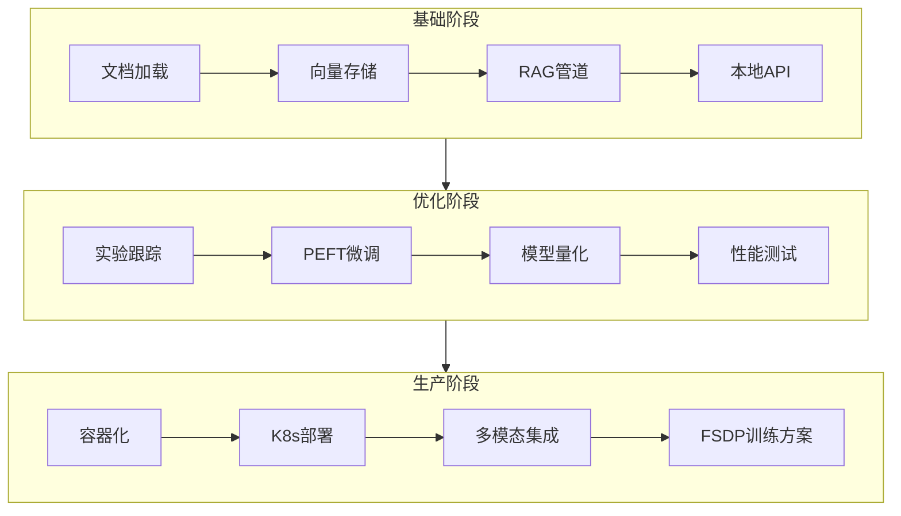

# 多模态企业知识管理Agent：渐进式敏捷开发路线图

## 项目概述

本项目旨在构建一个智能的企业知识管理Agent，能够处理和理解多种形式的企业知识资产（文档、图像等）。项目采用**敏捷开发方法**，分三个关键Sprint进行迭代开发，确保每个阶段都能交付可用的产品增量。

**核心开发原则**：
- **渐进式复杂性**：从文本MVP开始，逐步增加多模态能力
- **生产就绪导向**：每个Sprint都包含性能优化和生产化考量
- **全技术栈覆盖**：确保练习到所有要求的技术组件

以下是项目整体路线图，展示了三个Sprint的演进过程：

## Sprint 1：核心文本问答MVP - "打下地基"

### 目标
构建一个可本地运行的、基于私有文档的智能文本问答系统，建立完整的数据流和基础架构。

### 核心任务清单

1.  **项目基础设置**
    - 初始化Git仓库，配置`.gitignore`（排除大模型权重、敏感数据）
    - 创建Python虚拟环境，规范依赖管理（`requirements.txt`或`poetry`）
    - 设计项目目录结构（模块化组织：`data/`, `src/rag/`, `src/models/`, `tests/`）

2.  **文档处理与向量化管道**
    - 实现PDF文档解析器（使用`pypdf`或`pdfplumber`）
    - 设计文本分块策略（重叠分块，考虑语义边界）
    - 集成Hugging Face Embedding模型（如`BGE`系列）
    - 构建向量数据库（Chroma）持久化存储

3.  **大模型推理本地部署**
    - 使用vLLM在本地GPU部署Llama 3 8B模型
    - 验证模型基础问答能力（设计简单测试用例）
    - 实现温度（temperature）和top-p参数调节

4.  **RAG管道与API开发**
    - 实现检索器（结合相似度检索与关键词增强）
    - 设计提示词模板，优化RAG响应质量
    - 开发FastAPI接口：文档上传、问答、健康检查
    - 添加基础错误处理和日志记录

5.  **容器化与环境标准化**
    - 创建Dockerfile（多阶段构建，优化镜像大小）
    - 编写docker-compose.yml（协调向量数据库、API服务）
    - 验证本地完整流程（文档上传→向量化→问答）

### 本阶段重点技术栈
`Python`, `Git`, `Docker`, `PyTorch`, `Hugging Face Transformers`, `RAG`, `vLLM`, `FastAPI`, `Chroma`, `Llama 3`

### 成功指标（验收标准）
1. 成功将技术文档PDF存入Chroma，可查询文档内容结构
2. 通过API提问"文档中提到的架构核心组件是什么？"能获得基于文档的准确回答
3. vLLM部署的Llama 3 8B模型响应延迟低于500ms（平均）
4. Docker容器一键启动完整服务，Git提交历史清晰

## Sprint 2：模型定制与性能优化 - "追求卓越"

### 目标
提升问答质量与系统效率，通过领域微调和性能优化使模型更"专业"。

### 核心任务清单

1.  **实验跟踪与数据管理**
    - 集成MLflow，跟踪模型训练指标、参数和工件
    - 构建领域特定的QA数据集（基于企业文档生成问答对）
    - 设计数据评估流程，建立基准测试集

2.  **PEFT微调与评估**
    - 实现LoRA配置，针对领域数据微调Llama 3 8B
    - 设计对比实验：基础模型 vs 微调模型
    - 使用BLEU、ROUGE和人工评估微调效果
    - 验证领域术语理解和回答准确性提升

3.  **模型量化与推理优化**
    - 应用INT4量化（使用AWQ或GPTQ）
    - 优化vLLM服务配置（并行度、批处理大小）
    - 压力测试：评估吞吐量、显存占用和响应延迟

4.  **A/B测试与管道优化**
    - 实现影子模式部署，同时运行新旧模型
    - 设计在线评估指标（回答相关性、有用性评分）
    - 优化检索策略，改善chunking和重排效果

### 本阶段重点技术栈
`PEFT`/`LoRA`, `MLflow`, `模型量化`, `vLLM`, `A/B测试`, `PyTorch`

### 成功指标（验收标准）
1. 微调模型在领域测试集上准确率提升10%（相比基础模型）
2. 量化后模型显存占用降低40%，推理速度提升30%
3. A/B测试显示微调模型在人工评估中获胜率超过70%
4. MLflow完整记录所有实验，可复现最佳模型

## Sprint 3：生产化与多模态扩展 - "全面交付"

### 目标
将系统部署到云上，并扩展其理解图像内容的能力，实现生产就绪的多模态系统。

### 核心任务清单

1.  **Kubernetes生产部署**
    - 创建Kubernetes清单（Deployment, Service, Ingress）
    - 配置AWS EKS集群，设置节点组和存储类
    - 实现ConfigMap和Secret管理敏感配置
    - 设置HPA（Horizontal Pod Autoscaler）自动扩缩容

2.  **多模态能力集成**
    - 集成CLIP模型，实现图像编码和检索
    - 扩展向量数据库支持多模态嵌入（文本+图像）
    - 设计多模态提示词模板，联合处理文本和视觉信息
    - 实现图像-文本关联检索（如"找到与这张图表类似的文档"）

3.  **分布式训练方案设计（可选挑战）**
    - 设计FSDP训练流程，支持Llama 3 70B等大模型
    - 配置多节点GPU训练环境（AWS EC2 p4d实例）
    - 优化检查点保存/加载策略，减少训练中断影响

4.  **生产级监控与CI/CD**
    - 实现Prometheus监控指标（QPS、延迟、错误率）
    - 设置Grafana仪表盘可视化系统状态
    - 建立GitHub Actions CI/CD管道（自动化测试、构建、部署）
    - 配置日志聚合和告警机制（CloudWatch）

### 本阶段重点技术栈
`Kubernetes`, `AWS`/`EKS`/`S3`/`EC2`, `CLIP`, `分布式训练`/`PyTorch FSDP`, `Docker`, `Prometheus`, `CI/CD`

### 成功指标（验收标准）
1. 系统在EKS上稳定运行，支持自动扩缩容（峰值QPS > 50）
2. 成功回答图文混合问题（如"解释这张架构图中的组件"）
3. FSDP训练方案能有效利用多GPU节点（线性加速比 > 0.8）
4. CI/CD管道实现一键部署，监控系统覆盖关键指标

## 总结与演进建议

这个三阶段路线图确保了你能够系统性地练习全部要求的技术栈，同时每个Sprint都交付可用的产品增量。根据敏捷开发原则，每个Sprint结束后都应进行回顾，评估成果并调整后续计划。

**项目演进可能性**：
- **Sprint 4+**：考虑增加音频处理、多Agent协作或实时协作编辑等高级功能
- **技术深化**：探索更复杂的RAG模式（如HyDE、子查询分解）或模型微调技术（DPO）

通过这个项目，你将构建一个完整的生产级多模态知识管理系统，同时全面掌握现代AI全栈开发的核心技能。开始Sprint 1吧，记住敏捷的核心是**持续交付和迭代改进**！
